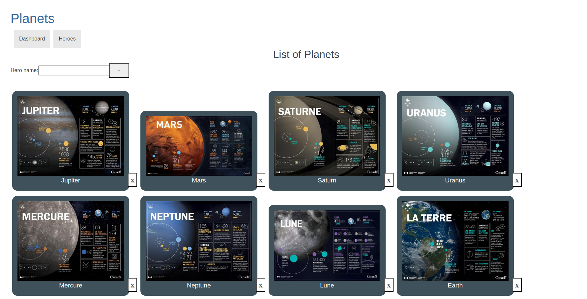

# TourPlanets

- Este projeto foi criado em angular e TourPlanets são fotos de planetas do sistema que futuramente poderam ser inserido.

  

    
  

## Desenvolvimento em live
Rode `npm install` para instalar e criar a pasta node_modules

Rode `ng serve` para desenvolver em Live. 
Navegue para `http://localhost:4200/`. 

