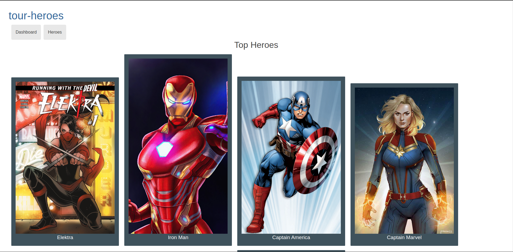

# TourHeroes

- Este projeto foi criado em angular e TourHeroes são fotos de herois da dc e marvel que futuramente poderam ser inserido.

  

    
  

## Desenvolvimento no modo live
   - Rode `npm install` Ou `yarn` para instalar e criar a pasta node_modules

   - Rode `ng serve` ou `npm start` ou `yarn start` para desenvolver em Live. 

   - Navegue para <a href="http://localhost:4200/">TourHeroes</a>. 

